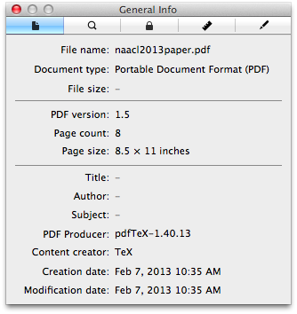
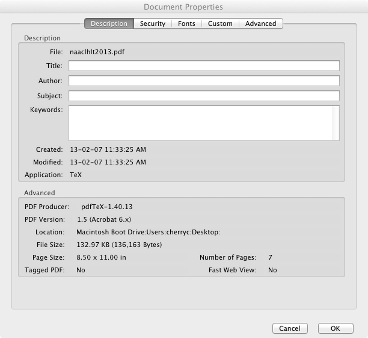
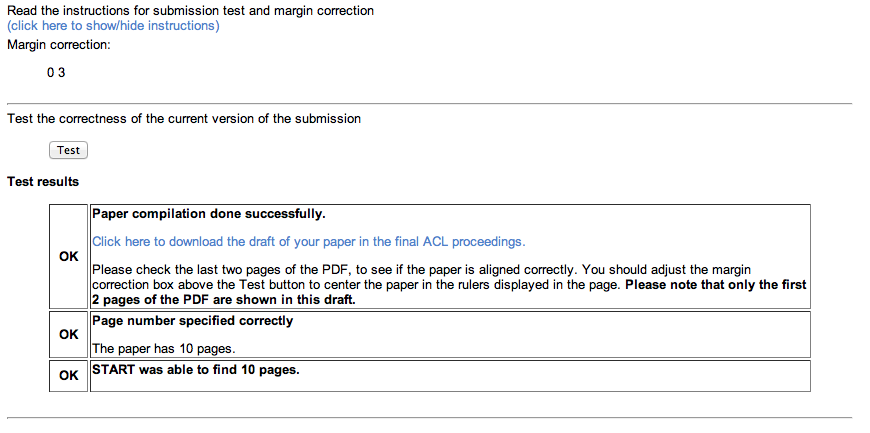

-  [When and where do I send my final camera-ready paper?](#when-and-where-do-i-send-my-final-camera-ready-paper)
-  [What common mistakes do people make? What should I pay special attention to?](#what-common-mistakes-do-people-make-what-should-i-pay-special-attention-to)
-  [How should the final copy differ from the original submission?](#how-should-the-final-copy-differ-from-the-original-submission)
-  [How long can it be?](#how-long-can-it-be)
-  [What's the deal with including an Appendix? Do I include it as supplemental?](#whats-the-deal-with-including-an-appendix-do-i-include-it-as-supplemental)
-  [What is the format for the camera-ready copy?](#what-is-the-format-for-the-camera-ready-copy)
-  [How do I ensure that my file is correctly formatted?](#how-do-i-ensure-that-my-file-is-correctly-formatted)
-  [What if my paper includes graphics?](#what-if-my-paper-includes-graphics)
-  [What about copyright?](#what-about-copyright)
-  [What if my paper's title or author list has changed?](#what-if-my-papers-title-or-author-list-has-changed)
-  [My question isn't answered here...?](#my-question-isnt-answered-here)

# What common mistakes do people make? What should I pay special attention to?

   - When entering the metadata for your paper, **please** use the
     lookup mechanism to search for your co-authors' names by account
     ID. This links the paper to their START account and, crucially,
     takes their preferred name formatting for the metadata. If you
     enter the authors' names manually, it will be more work for you,
     and you might introduce error.

     This metadata is very important, since it is what is used to link
     the paper in repositories like the
     [ACL anthology](http://www.aclweb.org/anthology/)** (and in
     Google Scholar, etc).

     

#  When and where do I send my final camera-ready paper?

   You may submit the final
   version of your paper by
   [navigating to the NAACL 2018 START login](https://www.softconf.com/naacl2018/papers)
   and following the internal links. You should have received an email
   with more information about this procedure.

#  How should the final copy differ from the original submission?

   The camera-ready version of your paper should incorporate the
   comments of the reviewers as well as other changes you see fit to
   make. In addition, be sure to do all of the following:

   - Include the authors' names and affiliations under the title.
   - De-anonymize references to your own work in the body of the paper.
   - Where appropriate, add acknowledgments for colleagues, reviewers, and grants.
   - Ensure that all tables, graphs, and figures are readable when
     viewed in black and white (to help the color-blind and those
     reading print-outs).

#  How long can it be?

   For both long and short papers, we allow one extra page to help
   address reviewer comments.  So long papers are permitted at most 9
   pages of text plus additional pages containing Acknowledgements, References, and Appendix.
   Short papers get 5 pages of text.
   
# What's the deal with including an Appendix? Do I include it as supplemental?

   You can include an Appendix, but the paper writing must be self-contained before the Acknowledgements.  Attach it as supplemental.

#  What is the format for the camera-ready copy?

   The file must be in Portable Document Format (PDF) on US Letter
   paper (8.5 x 11 inches).  We strongly recommend the use of ACL
   LaTeX style files (or Microsoft Word Style files) tailored for this
   year's conference. You can view the style files and detailed
   formatting instructions on the web
   [from the main pubs page](http://naacl.org/naacl-pubs/).

   If you are using LaTeX, please create the PDF file with
   <code>pdflatex</code> or <code>xelatex</code>.  This ensures use of
   the proper Type 1 fonts and also takes advantage of other PDF
   features. You will have the best results using a modern LaTeX
   distribution, in particular,
   [TeX live](http://www.tug.org/texlive/) (TeX Live 2014 is
   available).

#  How do I ensure that my file is correctly formatted?

   - [Make sure the paper is US Letter-sized](#format-size)
   - [Adjust the margin offsets when uploading](#format-margins)
   - [Embed custom fonts](#format-fonts)

   
   -  **Checking the paper size**. Your paper needs to be formatted to
      US Letter-sized (8.5 inches wide and 11 inches tall). Here are a
      couple of ways to check this: 
      <ul> 
      <li>    
      Using pdfinfo. The `pdfinfo` command should include

            Page size:      612 x 792 pts (letter)

        in its output.
      </li>
      <li>
      Using Apple's Preview.app. Open the PDF, and type &#8984-I. It should report the
        correct page size. 
        
        .
      </li>
      <li>
      Using Adobe Acrobat. Open the PDF, navigate to File, Properties..., Description. The
        field labeled "Page Size" should read 8.50 x 11.00 in.

      
      </li>
      </ul>

   
   - **Adjusting margin offsets**. The text of your paper will almost
     certainly be shifted slightly relative to other papers. When the
     book is assembled, the boundary around the printed portion of
     your paper may need to be shifted so that each paper is in the
     same position on each page. Here is an example of a page printed
     with the margin boundaries that demonstrates this shifting:

   

   START provides you with the means to fix this
     margin offset; please do!. To do so, after you upload
     your camera-ready paper, you will be presented with a small form
     that presents you with guides and allows you to adjust these
     offsets. Click on the "Test" button, then <b>click the link that
     reads "Click here to download the draft of your paper in the
     final ACL proceedings."</b>. You will be presented with a version
     of the proceedings containing only your paper, annotated with
     guidelines that help you shift the content of your paper.

   

   Please determine the required adjustments and enter them here. You can click "(click here to
   show/hide instructions)" for more information on how to do this.

   
   **If your paper uses Asian fonts,** please ensure that they are
   embedded in the PDF file so that they can be displayed by
   non-Asian versions of the PDF reader.  (Asian versions ship with
   a larger set of default fonts.)
     
     
#  What if my paper includes graphics?

   Remember that you are providing a camera-ready copy.  Thus, artwork
   and photos should be included directly in the paper in their final
   positions.  Ideally, you should use vector graphic formats (PDF,
   EPS), which allow the graphics to scale arbitrarily. Avoid GIF or
   JPEG images that are low resolution or highly compressed.

   Your paper must look good both when printed (8.5" x 11" size,
   black-and-white) and when viewed onscreen as PDF (zoomable to any
   size, color okay).  Thus, you may want to use color high-resolution
   graphics, allowing onscreen readers to zoom in on a graph and study
   it.  However, *please* check that the same graph or photograph
   is legible when printed on a black-and-white printer.  For example,
   different lines in a graph should not be distinguished only by
   color, although they can <i>also</i> be distinguished by color.

   A good test is to print the paper on your own black-and-white laser
   printer, and to view it in a PDF viewer at different
   resolutions.

   Don't go overboard on resolution; keep file sizes manageable.  Note
   that vector graphics (e.g., encapsulated PostScript) look good at
   any scale and take up little space (unless you are plotting many
   thousands of data points).

#  What about copyright?

   When you submit the paper, you will be asked to sign electronically
   (via the START Conference Manager) or physically the
   [ACL Copyright Transfer Agreement](copyright/naacl2013-copyright.pdf)
   on behalf of all authors. Authors retain many rights under this
   agreement and it is appropriate in the vast majority of cases.
   Please
   [contact the chairs](mailto:naacl-pub-chairs@googlegroups.com) with
   any concerns regarding copyright.

   Before signing this form, please confirm with your co-authors (and,
   if applicable, your and their employers) that they authorize you to
   sign on their behalf.

#  What if my paper's title or author list has changed?

   Then please edit those metadata fields when you upload the
   camera-ready version, so that they will appear correctly in the
   table of contents, author index, conference schedule, etc. Please also note that your name will appear in
   conference metadata as you have configured it in Softconf's system,
   so make sure that it is correct there (e.g., capitalization, full
   name, etc). You can change this on
   [user settings page](https://www.softconf.com/naacl2015/papers/user/scmd.cgi?scmd=updateProfile).

#  My question isn't answered here...?

   Please email the publications chairs at
   [naacl-pub-chairs@googlegroups.com](mailto:naacl-pub-chairs@googlegroups.com).
   We will update this page if new issues arise.
